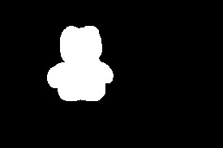
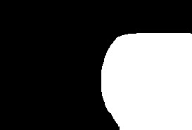
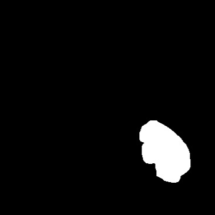
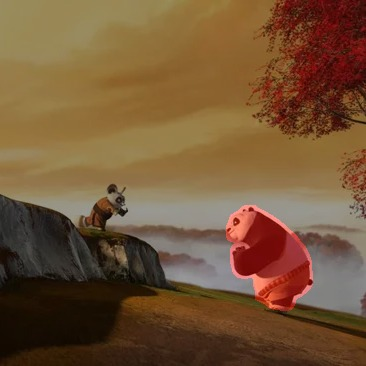
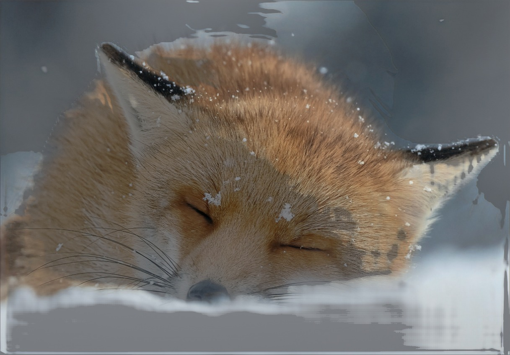
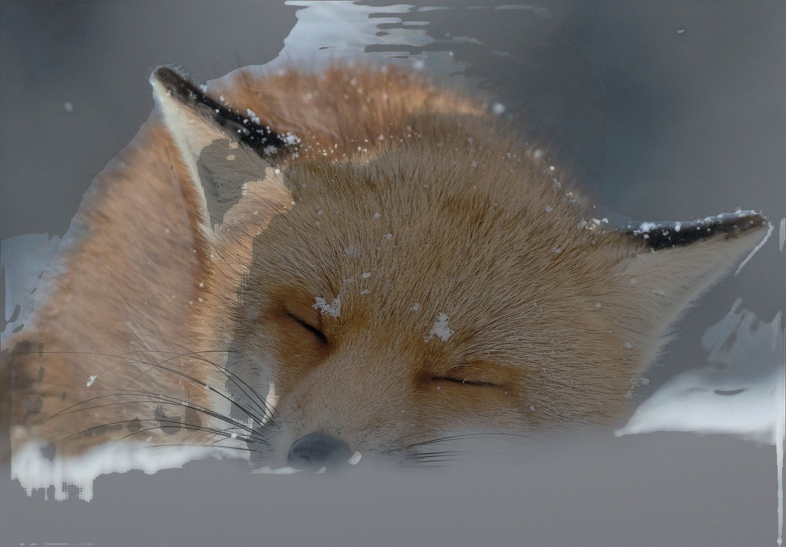

# AI Image Editing Workflows


**Production-ready AI pipelines for interactive image editing: object removal/replacement, background transformation, and neural relighting - optimized for both desktop and edge deployment.**

---

## Features

### Feature 1: Object Editing Pipeline
- **Multi-Modal Segmentation** - Box, Point, Sketch, or Text-based object selection via MobileSAM
- **Object Removal** - Seamless inpainting using LaMa (Large Mask)
- **Object Replacement** - AI-generated content via Stable Diffusion + LCM-LoRA (4-25 diffusion steps, adjustable mask dilation)
- **Background Replacement** - Change backgrounds while preserving foreground subjects (configurable diffusion steps and dilation)
- **AI Agent Mode** - Natural language interface using Mistral AI for automatic prompt extraction
- **ONNX Export** - FP16/FP32/INT8 quantized models for edge deployment

### Feature 2: Neural Relighting
- **Interactive Relighting** - Change lighting direction and intensity via arrow drawing or sliders
- **Z-Depth Control** - Adjustable light depth (-1 to 1) for 3D lighting effects
- **Intensity Control** - Light brightness adjustment (0 to 3)
- **Lightweight Architecture** - TinyRelightNet U-Net with ~1.2M parameters
- **Physics-Based Priors** - Lambertian + Blinn-Phong shading as network input
- **MiDaS Depth Estimation** - Automatic depth and surface normal computation
- **FiLM Conditioning** - Dynamic light control via Feature-wise Linear Modulation

### Streamlit Web Demo
- **Unified Interface** - Both features accessible via web UI
- **Interactive Canvas** - Draw, click, or text-based object selection
- **Real-time Preview** - Live mask overlay and result visualization

---

## Results

### Feature 1: Object Editing Pipeline

#### 1.1 Object Removal

| Original | Mask | Overlay | Result |
|----------|------|---------|--------|
|  |  |  |  |

#### 1.2 Object Replacing

| Original | Mask | Overlay | Result |
|----------|------|---------|--------|
|  |  |  |  |

#### 1.3 Background Filling

| Original | Mask | Overlay | Result |
|----------|------|---------|--------|
|  |  |  |  |

### Feature 2: Neural Relighting

| Original | Relighted from Right | Relighted from Left |
|----------|---------------------|---------------------|
|  |  |  |

---

## Project Setup

Follow these steps to set up and run the project:

### Step 1: Clone the Repository

```bash
git clone https://github.com/team24-stack/adobe.git
cd adobe
```

### Step 2: Download Model Weights from Google Drive

Download the pre-trained model weights and place them in the correct folders:

**Feature 1 - Object Editing Checkpoints:**
- Download from: https://drive.google.com/drive/folders/1TX6K2eNr50Ano966-gnh2V4OfNR2ht5F?usp=sharing
- Extract contents to: `./feature1/checkpoints/`

```
feature1/checkpoints/
├── mobile_sam.pt
├── lama-dilated/
├── lcm-lora-sdv1-5/
└── stable-diffusion-inpainting/
```

**Feature 1 - ONNX Models (Optional for edge deployment):**
- Download from: https://drive.google.com/drive/folders/16zHf-qSeWYNyR-UsTC4SNQNhEpJqMNuK?usp=sharing
- Place in: `./feature1/onnx_export/`

**Feature 2 - Neural Relighting Weights:**
- Download from: https://drive.google.com/drive/folders/1mLbVY4FS2095KfHLqHv39u-KKLHIG_X0?usp=sharing
- Place in: `./feature2/weights/`

```
feature2/weights/
└── model.pth
```

### Step 3: Create Virtual Environment (Python 3.12)

```bash
python -m venv venv
```

### Step 4: Activate the Virtual Environment

**Windows:**
```bash
.\venv\Scripts\activate
```

**Linux/Mac:**
```bash
source venv/bin/activate
```

### Step 5: Install Dependencies

```bash
pip install -r requirements.txt
```

### Step 6: Set Mistral API Key (Optional - for AI Agent feature)

Create a config file for the AI Agent feature:

```bash
# Create config file
echo "MISTRAL_API_KEY = 'your-mistral-api-key-here'" > feature1/src/config.py
```

Or set as environment variable:

**Windows (PowerShell):**
```powershell
$env:MISTRAL_API_KEY = "your-mistral-api-key-here"
```

**Linux/Mac:**
```bash
export MISTRAL_API_KEY="your-mistral-api-key-here"
```

> Note: The AI Agent feature is optional. Without the API key, the app will use direct text-to-CLIP matching for object segmentation.

### Step 7: Run the Streamlit Application

```bash
streamlit run app.py
```

Open http://localhost:8501 in your browser to access the application.

---

## Quick Start Summary

```bash
# Complete setup in one go
git clone https://github.com/team24-stack/adobe.git
cd adobe

# Download weights from Google Drive and place in respective folders:
# - feature1/checkpoints/
# - feature2/weights/

python -m venv venv
.\venv\Scripts\activate          # Windows
# source venv/bin/activate        # Linux/Mac

pip install -r requirements.txt

# Optional: Set Mistral API key for AI Agent
$env:MISTRAL_API_KEY = "your-api-key"

streamlit run app.py
```

---

## Alternative: Command Line Usage

### Object Editing (Feature 1)

```bash
# Interactive GUI
python -m feature1.src.interactive_pipeline --image ./images/test.jpg

# Object removal only
python -m feature1.src.object_removing --input_img ./images/test.jpg --output_dir ./results
```

**Controls:**
| Key | Action |
|-----|--------|
| `1` | Object Removal (LAMA) |
| `2` | Object Replacement (SD+LCM) |
| `3` | Background Replacement |
| `b/c/s` | Box/Click/Sketch mode |
| `a` | Apply operation |
| `q` | Quit |

### Neural Relighting (Feature 2)

```bash
# Interactive GUI with arrow drawing
python -m feature2.src.interactive_inference \
    --image ./images/portrait.jpg \
    --weights ./feature2/weights/model.pth

# CLI batch inference
python -m feature2.src.inference \
    --image ./images/test.jpg \
    --weights ./feature2/weights/model.pth \
    --light-dir 1 0 -1 \
    --intensity 1.5
```

**Controls:**
| Action | Description |
|--------|-------------|
| Draw Arrow | Set light direction (start to end) |
| Z Slider | Adjust light depth (-1 to 1) |
| Intensity Slider | Adjust brightness (0 to 3) |
| Apply Button | Run full inference |

---

## Architecture

### Feature 1: Object Editing Pipeline

```
┌─────────────────────────────────────────────────────────────────┐
│                    User Input (Image + Selection)                │
└───────────────────────────────┬─────────────────────────────────┘
                                │
        ┌───────────────────────┼───────────────────────┐
        ▼                       ▼                       ▼
   ┌─────────┐            ┌─────────┐            ┌─────────┐
   │   Box   │            │  Click  │            │  Text   │
   │  Mode   │            │  Mode   │            │ (CLIP)  │
   └────┬────┘            └────┬────┘            └────┬────┘
        └───────────────────────┼───────────────────────┘
                                ▼
                    ┌───────────────────────┐
                    │      MobileSAM        │
                    │   (9.7M params)       │
                    └───────────┬───────────┘
                                │
        ┌───────────────────────┼───────────────────────┐
        ▼                       ▼                       ▼
   ┌─────────┐            ┌─────────┐            ┌─────────┐
   │ REMOVE  │            │ REPLACE │            │BACKGRND │
   │  LAMA   │            │ SD+LCM  │            │ SD+LCM  │
   │  51M    │            │ 4 steps │            │ 4 steps │
   └────┬────┘            └────┬────┘            └────┬────┘
        └───────────────────────┼───────────────────────┘
                                ▼
                    ┌───────────────────────┐
                    │     Output Image      │
                    └───────────────────────┘
```

### Feature 2: Neural Relighting Pipeline

```
+------------------------------------------------------------------+
|                 Input: RGB Image + Light Vector                   |
+------------------------------------------------------------------+
                                │
              ┌─────────────────┼─────────────────┐
              ▼                 ▼                 ▼
       ┌───────────┐     ┌───────────┐     ┌───────────┐
       │   MiDaS   │     │  Normals  │     │ Physics   │
       │   Depth   │ ──► │  Compute  │ ──► │ Render    │
       └───────────┘     └───────────┘     └───────────┘
              │                 │                 │
              └─────────────────┼─────────────────┘
                                ▼
                    ┌───────────────────────┐
                    │    TinyRelightNet     │
                    │   U-Net + FiLM        │
                    │   (1.2M params)       │
                    │   [lx, ly, lz, int]   │
                    └───────────┬───────────┘
                                │
                                ▼
                    ┌───────────────────────┐
                    │   Physics + Residual  │
                    │    → Relit Image      │
                    └───────────────────────┘
```

---

## Model Summary

| Component | Model | Parameters | Purpose | Edge-Ready |
|-----------|-------|------------|---------|------------|
| Segmentation | MobileSAM (ViT-Tiny) | 9.7M | Fast object masks | ONNX |
| Text Matching | CLIP ViT-B/32 | 151M | Text-to-region | ONNX |
| Inpainting | LaMa (Dilated) | 51M | Object removal | FP16 |
| Generation | SD v1.5 + LCM-LoRA | 860M | Object/BG replacement (4-25 steps) | Fast |
| Depth | MiDaS Small | 21M | Monocular depth | Yes |
| Relighting | TinyRelightNet | 1.2M | Neural relight | Yes |
| Agent | Mistral AI | Cloud | Prompt extraction | API |

---

## Configuration

### Environment Variables

```bash
# Disable HF transfer (avoids errors)
export HF_HUB_ENABLE_HF_TRANSFER=0

# API key for Agent mode (optional)
export MISTRAL_API_KEY=your_key
```

### API Keys Setup

For the AI Agent feature, create `feature1/src/config.py`:

```python
# feature1/src/config.py
MISTRAL_API_KEY = "your-mistral-api-key"
```

> ⚠️ This file is git-ignored. See `config.example.py` for template.

---

## ONNX Export (Edge Deployment)

Export models for mobile/edge deployment:

```bash
# Export MobileSAM to ONNX
python -m feature1.src.export_sam_onnx \
    --checkpoint ./feature1/checkpoints/mobile_sam.pt \
    --output_dir ./feature1/onnx_export \
    --fp16  # Optional: FP16 quantization

# Exported models:
# - sam_image_encoder.onnx (~38 MB)
# - sam_mask_decoder_point.onnx (~16 MB)
# - sam_mask_decoder_box.onnx (~16 MB)
# - lama_fp16.onnx (~102 MB)
```

---

## Citation

```bibtex
@software{ai_image_editing_workflows,
  title = {AI Image Editing Workflows},
  author = {Team24-Stack},
  year = {2024},
  url = {https://github.com/team24-stack/workflows},
  note = {Object editing and neural relighting pipelines}
}
```

### Related Works

```bibtex
@article{kirillov2023segment,
  title={Segment Anything},
  author={Kirillov, Alexander and others},
  journal={ICCV}, year={2023}
}

@article{suvorov2022resolution,
  title={Resolution-robust Large Mask Inpainting with Fourier Convolutions},
  author={Suvorov, Roman and others},
  journal={WACV}, year={2022}
}

@article{rombach2022high,
  title={High-Resolution Image Synthesis with Latent Diffusion Models},
  author={Rombach, Robin and others},
  journal={CVPR}, year={2022}
}

@article{ranftl2020midas,
  title={Towards Robust Monocular Depth Estimation},
  author={Ranftl, Ren{\'e} and others},
  journal={IEEE TPAMI}, year={2022}
}

@inproceedings{helou2020vidit,
  title={VIDIT: Virtual Image Dataset for Illumination Transfer},
  author={El Helou, Majed and others},
  booktitle={arXiv:2005.05460}, year={2020}
}
```

---

## License

This project is licensed under the MIT License.

Third-party model licenses:
- MobileSAM: Apache 2.0
- LaMa: Apache 2.0  
- Stable Diffusion: CreativeML Open RAIL-M
- LCM-LoRA: MIT
- MiDaS: MIT
- VIDIT Dataset: CC BY-NC-SA 4.0

See `feature1/LICENSES/` and `feature2/LICENSES/` for full license texts.

---

## Acknowledgments

- [Segment Anything (Meta AI)](https://github.com/facebookresearch/segment-anything)
- [MobileSAM](https://github.com/ChaoningZhang/MobileSAM)
- [LaMa Inpainting](https://github.com/advimman/lama)
- [Stable Diffusion](https://github.com/CompVis/stable-diffusion)
- [LCM-LoRA](https://github.com/luosiallen/latent-consistency-model)
- [MiDaS](https://github.com/isl-org/MiDaS)
- [VIDIT Dataset](https://github.com/majedelhelou/VIDIT)
- [OpenCLIP](https://github.com/mlfoundations/open_clip)
